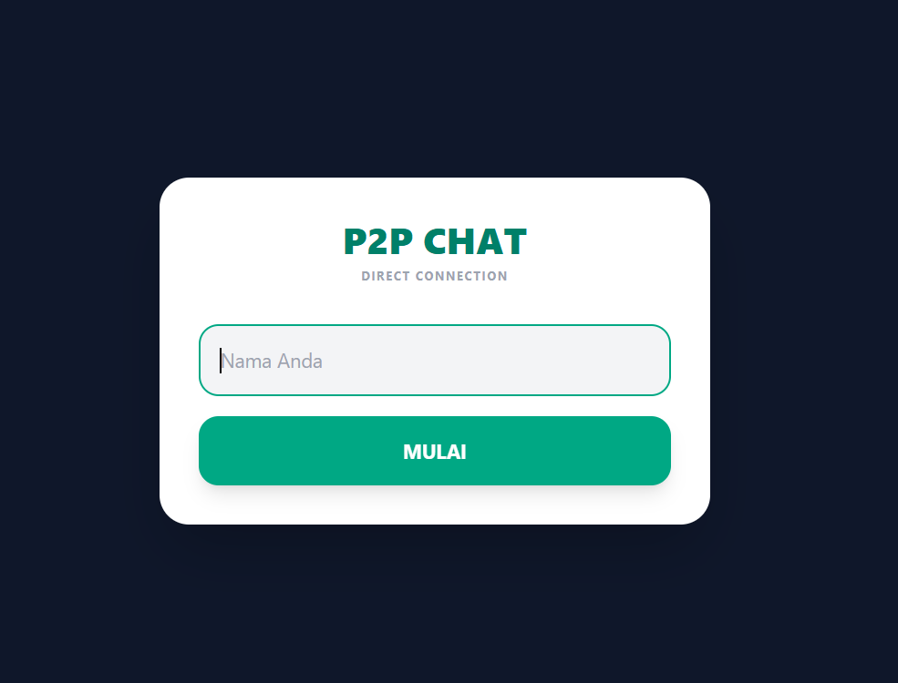
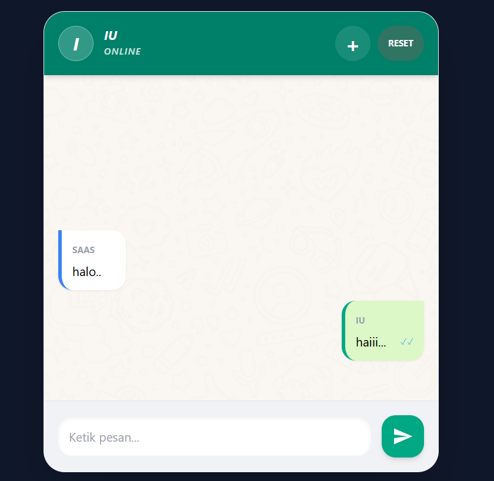

# P2P Chat - Direct Peer Connection 🚀

A lightweight, browser-based Peer-to-Peer (P2P) chat application built with **WebRTC** and **Tailwind CSS**. This project allows two users to communicate directly without a central server for messaging, ensuring privacy and low latency.

## 🌟 Features

*   **Serverless Messaging**: Uses WebRTC DataChannels for direct browser-to-browser communication.
*   **Real-time Interaction**: Instant message delivery with status indicators.
*   **Message Management**: Supports **Edit** and **Delete** actions with synchronized updates across both peers.
*   **Responsive UI**: Modern WhatsApp-style interface built with Tailwind CSS.
*   **Custom Context Menu**: Clean "Edit, Hapus, Batal" menu for a better user experience.
*   **No Database Required**: All data is handled in-memory and through direct signaling.

## 📸 Interface

  

  

## 🛠️ Tech Stack

*   **HTML5 & CSS3**
*   **JavaScript (ES6+)**
*   **Tailwind CSS** (via CDN)
*   **WebRTC API** (Signaling via manual exchange)

## 🚀 Getting Started

To use this application locally or via [GitHub Pages](https://mahmuda1004.github.io/chat-p2p/):

1.  **Open the App**: Launch the application on two different devices or browser tabs.
2.  **Join**: Enter your name and click **Mulai**.
3.  **Signaling Process**:
    *   **User A**: Click **"1. Buat Undangan"**, copy the generated code, and send it to User B.
    *   **User B**: Paste the code from User A, click **"2. Terima & Balas"**, then copy the new code generated and send it back to User A.
    *   **User A**: Paste the code from User B and click **"2. Terima & Balas"**.
4.  **Connected**: Once the status turns **ONLINE**, you can start chatting!

## 📸 Interface

*   **Login Screen**: Simple name entry.
*   **Signaling Panel**: Manual exchange area for establishing the P2P link.
*   **Chat Box**: Features message bubbles with edit/delete capabilities.

## 📝 Planned Improvements

*   [ ] Integration with **Firebase** for automated signaling (no more manual code copying).
*   [ ] Support for Group Chats (Multi-peer mesh network).
*   [ ] File sharing capabilities.

---
Developed by **Mahmuda** 
*Graduate of Informatics, Universitas Mulawarman*
